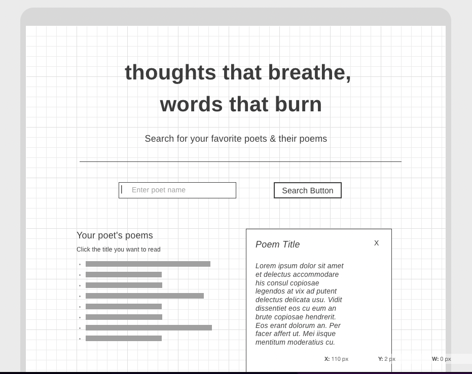

# thoughts_that_breathe_words_that_burn

## Description
A searchable webpage with API call devoted to British and American poetry from Chaucer until 1899.

## Overview
> "Poetry is thoughts that breathe, and words that burn." —Thomas Gray

In this project, I make use of a poetry database API (https://poetrydb.org/index.html) that allows users to search for poems by specific poets. Users can enter the name of a poet from this era and search one of their poems. My goal is to make this a source of learning and inspiration for users.

## Credits
The following sites provide similar service on a much larger scale:
- https://www.poetryfoundation.org/
- https://poets.org/
- https://poems.com/

## Project Tracker
To manage this project, I am using Trello to create to-do lists and deadline reminders, and to set goals and important milestones. The project can be followed here:
https://trello.com/invite/b/UC42IhmR/7e5488bb26b9d6563695ad48f5f53f00/project-1

## Initial Wireframe

